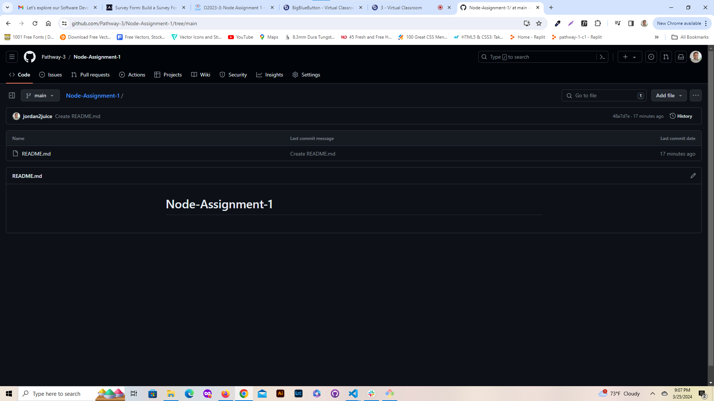
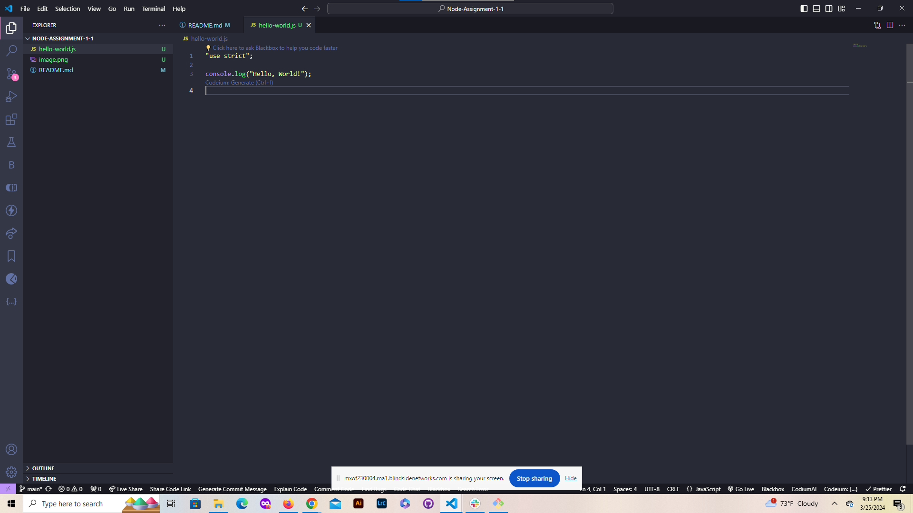
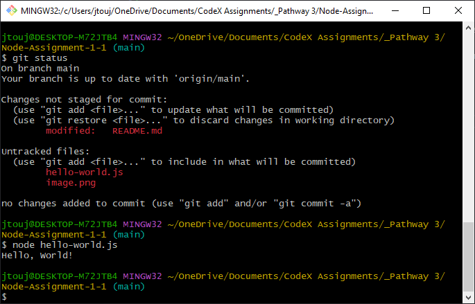

# Node-Assignment-1

Created the Repository and Added my README.md file with details about the project.

## Project Title: "Node Assignment 1"

This is my Repository for my assignment. It contains a readme file which explains how to use this repository in detail along with images of the

**Project Description:** This is a simple Node.js application that uses Express to create a server, which serves static files.

Created the javascript for my Console.log ('Hello World')

In the terminal I got the console.log to say "Hello World"